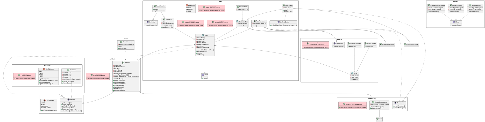

## Simulador de Robôs — Laboratório 5 (MC322, UNICAMP 2025/1)

**Autores:** Giovanni Santos Scalabrin (RA 281210) & Rodrigo Banin Ferraz Camargo (RA 238257)

---

### Descrição

Esta versão expande significativamente o simulador de robôs com:

* Ambiente 3D com sistema de colisões e obstáculos
* Comunicação entre robôs via sistema centralizado
* Sensores especializados (proximidade/umidade)
* Comportamentos especializados por tipo de robô
* Sistema de exceções para tratamento de erros
* Menu interativo completo para controle da simulação
* **Novidades do Lab5:**

  * Arquitetura modular com subsistemas internos
  * Robôs autônomos com capacidade de executar missões
  * Sistema de missões com implementações específicas
  * Geração de logs de execução
  * Composição avançada via classes abstratas e interfaces

---

### Ferramentas

* **IDE:** Visual Studio Code
* **Java:** OpenJDK 21.0.5
* **Gerenciamento de Dependências:** Java SE
* **Controle de Versão:** Git/GitHub

---

### Estrutura do Projeto

```
src/
├── ambiente/                  # Classes do ambiente 3D
│   ├── Ambiente.java
│   └── ForaMapaException.java
├── comunicacao/               # Sistema de comunicação
│   ├── CentralComunicacao.java
│   ├── Comunicavel.java
│   └── ErroComunicacaoException.java
├── entity/                    # Entidades do sistema
│   ├── Entidade.java
│   └── TipoEntidade.java
├── missao/                    # Implementações de missões
│   ├── Missao.java
│   ├── MissaoCentroide.java
│   ├── MissaoExploracaoSegura.java
│   └── MissaoMatador.java
├── menus/                     # Interface de usuário
│   └── MenuInterativo.java
├── obstaculos/                # Obstáculos e tipos
│   ├── ColisaoException.java
│   ├── Obstaculo.java
│   └── TipoObstaculo.java
├── robos/                     # Implementações de robôs e subsistemas
│   ├── AgenteInteligente.java
│   ├── EstadoRobo.java
│   ├── Explodidor.java
│   ├── Ladrao.java
│   ├── Robo.java
│   ├── RoboAereo.java
│   ├── RoboAleatorio.java
│   ├── RoboAtirador.java
│   ├── RoboDesligadoException.java
│   ├── RoboDistraido.java
│   ├── RoboNotFoundException.java
│   ├── RoboTerrestre.java
│   ├── TaskNotFoundException.java
│   └── subsistemas/           # Subsistemas internos
│       ├── ControleMovimento.java
│       ├── GerenciadorSensores.java
│       └── ModuloComunicacao.java
├── sensores/                  # Sensores e interfaces
│   ├── NaoSensoriavelException.java
│   ├── Sensor.java
│   ├── SensorProximidade.java
│   ├── SensorUmidade.java
│   └── Sensoreavel.java
├── utils/                     # Utilitários
│   ├── DistanceCalculator.java
│   ├── RandomNumberGenerator.java
│   └── RandomStringGenerator.java
├── logging/                   # Gerenciamento de logs
│   └── LoggerConfig.java
└── Main.java                  # Ponto de entrada
```

---

### Compilação e Execução

**Compilar o projeto:**

```bash
javac -d bin $(find src/lab05 -name "*.java")
```

**Executar a simulação:**

```bash
java -cp bin main/Main
```

---
### Diagrama de Classes

---

### Arquitetura e Componentes Principais

#### 1. Sistema de Missões (`missao/`)

Implementa o padrão Strategy:

* `Missao`: Interface base
* `MissaoCentroide`: Move até o centro de outros robôs
* `MissaoExploracaoSegura`: Evita obstáculos
* `MissaoMatador`: Robô atirador elimina alvos

Cada missão gera log em `logs/` com:

* Posições visitadas
* Sensores ativados
* Obstáculos detectados
* Ações realizadas

#### 2. Robôs Autônomos (`AgenteInteligente.java`)

Classe abstrata para robôs com missão:

```java
public abstract class AgenteInteligente extends Robo {
    protected Missao missao;
    private final GerenciadorSensores gerenciadorSensores;
    public void setMissao(Missao missao) { ... }
    public abstract void executarMissao();
}
```

* `RoboAtirador`: Missões de combate
* `RoboDistraido`: Pode falhar nas missões

#### 3. Subsistemas dos Robôs (`robos/subsistemas/`)

Composição modular:

* `ControleMovimento`: Colisão/movimento
* `GerenciadorSensores`: Sensores
* `ModuloComunicacao`: Mensagens

#### 4. Ambiente 3D (`Ambiente.java`)

Melhorias:

* Entidades dinâmicas
* Colisão tridimensional

#### 5. Tipos de Robôs

| Classe          | Habilidades         | Autônomo | Subsistemas         |
| --------------- | ------------------- | -------- | ------------------- |
| `Robo`          | Movimento básico    | Não      | ControleMovimento   |
| `RoboAereo`     | Altitude            | Não      | ControleMovimento   |
| `RoboAleatorio` | Teleporte, Explosão | Não      | ControleMovimento   |
| `RoboAtirador`  | Disparo, mensagens  | Sim      | Todos               |
| `RoboTerrestre` | Turbo               | Não      | Movimento, Com      |
| `RoboDistraido` | Missões com falhas  | Sim      | GerenciadorSensores |

#### 6. Sistema de Exceções

| Exceção                    | Ocorrência            |
| -------------------------- | --------------------- |
| `ForaMapaException`        | Robô fora dos limites |
| `ColisaoException`         | Colisão com entidade  |
| `RoboDesligadoException`   | Robô desligado/morto  |
| `RoboNotFoundException`    | Robô inexistente      |
| `TaskNotFoundException`    | Tarefa não suportada  |
| `NaoSensoriavelException`  | Sensor não disponível |
| `ErroComunicacaoException` | Falha de comunicação  |

---

### Comandos do Menu Interativo

#### Principais Comandos

```bash
missao <robo> adicionar <tipo>   # centroide, exploracao, matador
missao <robo> executar
move <robo> <dx> <dy>
executartarefa <robo> <tarefa> [args]
comunicar <de> <para> "<mensagem>"
monitorar <robo>
status
showmapa
```

#### Exemplos:

```bash
executartarefa drone subir 5
executartarefa sniper atirar
executartarefa random explodir 10
```

---

### Princípios de POO Aplicados

* **Abstração**: `AgenteInteligente`, `Missao`
* **Encapsulamento**: Subsistemas bem definidos
* **Herança**: Robo → RoboAereo → RoboAtirador
* **Polimorfismo**: Missões diferentes, interface comum
* **Composição**: Robôs com subsistemas internos
* **Coesão e Acoplamento**: Baixo acoplamento entre módulos

---

### Considerações Finais

Este laboratório demonstra conceitos avançados de POO:

* Arquitetura modular com subsistemas
* Comportamentos autônomos com Strategy
* Gerenciamento de estado com tratamento de erros
* Composição flexível e extensível
* Separacão entre lógica e apresentação

Extensível para novos tipos de:

* Robôs
* Missões
* Sensores e subsistemas
* Formatos de entrada/saída
