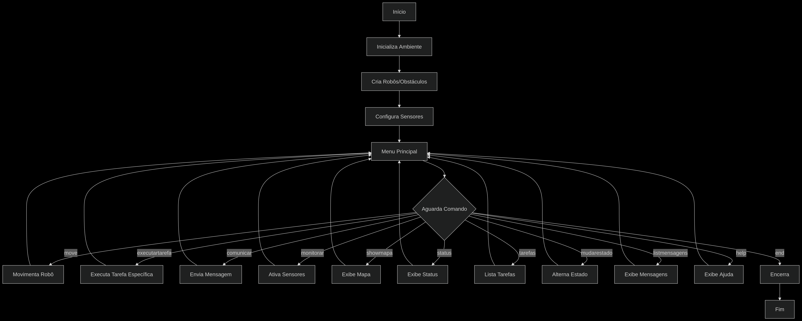

## Simulador de Robôs — Laboratório 4 (MC322, UNICAMP 2025/1)

**Autores:** Giovanni Santos Scalabrin (RA 281210) & Rodrigo Banin Ferraz Camargo (RA 238257)

---

### Descrição
Esta versão expande significativamente o simulador de robôs com:
- Ambiente 3D com sistema de colisões e obstáculos
- Comunicação entre robôs via sistema centralizado
- Sensores especializados (proximidade/umidade)
- Comportamentos especializados por tipo de robô
- Sistema de exceções para tratamento de erros
- Menu interativo completo para controle da simulação

---

### Ferramentas
- **IDE:** Visual Studio Code
- **Java:** OpenJDK 21.0.5

---

### Estrutura do Projeto
```
src/lab04
├── ambiente/           # Classes do ambiente 3D
│   ├── Ambiente.java
│   └── ForaMapaException.java
├── comunicacao/        # Sistema de comunicação
│   ├── CentralComunicacao.java
│   ├── Comunicavel.java
│   └── ErroComunicacaoException.java
├── entity/             # Entidades do sistema
│   ├── Entidade.java
│   └── TipoEntidade.java
├── menus/              # Interface de usuário
│   └── MenuInterativo.java
├── obstaculos/         # Obstáculos e tipos
│   ├── ColisaoException.java
│   ├── Obstaculo.java
│   ├── TipoObstaculo.java
├── robos/              # Implementações de robôs
│   ├── EstadoRobo.java
│   ├── Explodidor.java
│   ├── Ladrao.java
│   ├── Robo.java
│   ├── RoboAereo.java
│   ├── RoboAleatorio.java
│   ├── RoboAtirador.java
│   ├── RoboDesligadoException.java
│   ├── RoboNotFoundException.java
│   ├── RoboTerrestre.java
│   └── TaskNotFoundException.java
├── sensores/           # Sensores e interfaces
│   ├── NaoSensoriavelException.java
│   ├── Sensor.java
│   ├── SensorProximidade.java
│   ├── SensorUmidade.java
│   └── Sensoreavel.java
├── utils/              # Utilitários
│   ├── DistanceCalculator.java
│   ├── RandomNumberGenerator.java
│   └── RandomStringGenerator.java
└── Main.java           # Ponto de entrada
```

---

### Compilação e Execução
1. **Compilar o projeto:**
   ```bash
   javac -d bin src/*.java src/ambiente/*.java src/comunicacao/*.java src/entity/*.java src/menus/*.java src/obstaculos/*.java src/robos/*.java src/sensores/*.java src/utils/*.java
   ```
2. **Executar a simulação:**
   ```bash
   java -cp bin Main
   ```

---

### Arquitetura e Componentes Principais

#### 1. Ambiente 3D (`Ambiente.java`)
Representa o espaço tridimensional onde os robôs operam:
- Mapa 3D com coordenadas (X, Y, Z)
- Sistema de detecção de colisões
- Gerenciamento de entidades (robôs e obstáculos)
- Visualização 2D do plano XY (altura Z=0)

**Funcionalidades:**
- Verificação de limites com `ForaMapaException`
- Tratamento de colisões com `ColisaoException`
- Atualização dinâmica de posições

#### 2. Sistema de Comunicação (`CentralComunicacao.java`)
Gerencia mensagens entre robôs:
- Histórico de todas as comunicações
- Formatação automática de mensagens
- Interface `Comunicavel` para envio/recebimento

#### 3. Robôs e Especializações
| Classe            | Habilidades Únicas                     | Interfaces Implementadas       |
|-------------------|----------------------------------------|--------------------------------|
| `Robo` (Base)     | Movimento básico, Roubo de bateria     | `Entidade`, `Ladrao`           |
| `RoboAereo`       | Controle de altitude (subir/descer)    | -                              |
| `RoboAleatorio`   | Teleporte aleatório, Explosão          | `Explodidor`                   |
| `RoboAtirador`    | Disparo, Spam de mensagens             | `Comunicavel`, `EnchedorDeSaco`|
| `RoboTerrestre`   | Modo turbo (ignora obstáculos)         | `Comunicavel`                  |

#### 4. Sensores (`Sensor.java`)
| Tipo                  | Funcionalidade                          |
|-----------------------|-----------------------------------------|
| `SensorProximidade`   | Detecta entidades próximas              |
| `SensorUmidade`       | Mede nível de umidade do ambiente       |

Interface `Sensoreavel` permite ativação dos sensores

#### 5. Sistema de Exceções
| Exceção                     | Ocorrência Típica                          |
|-----------------------------|--------------------------------------------|
| `ForaMapaException`         | Movimento além dos limites do ambiente     |
| `ColisaoException`          | Colisão com outra entidade                |
| `RoboDesligadoException`    | Ação em robô desligado/morto              |
| `RoboNotFoundException`     | Robô não encontrado no ambiente           |
| `TaskNotFoundException`     | Tarefa não suportada pelo robô            |
| `NaoSensoriavelException`   | Ativação de sensores não disponíveis      |

---

### Comandos do Menu Interativo

#### Fluxo de Execução



#### Descrição Detalhada dos Comandos

1. **`move <nome_robo> <deltaX> <deltaY>`**  
   Move o robô especificado no plano XY:
   - Robôs terrestres: Movimento padrão com detecção de colisões
   - Robôs aéreos: Movimento incluindo altitude
   - RoboAleatorio: Teleporte para posição aleatória livre

2. **`executartarefa <nome_robo> <tarefa> [args]`**  
   Executa habilidades especiais conforme o tipo de robô:

   | Robô             | Tarefas Disponíveis               | Parâmetros                     | Funcionalidade                                                                 |
   |------------------|-----------------------------------|--------------------------------|--------------------------------------------------------------------------------|
   | Todos            | `roubar`                          | -                              | Rouba bateria de robôs próximos (inversamente proporcional à distância)        |
   | RoboAereo        | `subir`                           | `<deltaZ>`                     | Aumenta altitude                                                               |
   |                  | `descer`                          | `<deltaZ>`                     | Diminui altitude                                                               |
   | RoboAleatorio    | `explodir`                        | `<raio>`                       | Elimina robôs dentro do raio especificado                                      |
   | RoboAtirador     | `atirar`                          | -                              | Elimina robôs alinhados na direção atual                                       |
   |                  | `encherOSaco`                     | `<robô_alvo> <num_mensagens>`  | Envia mensagens aleatórias para outro robô                                     |
   | RoboTerrestre    | `turbo`                           | `<deltaX> <deltaY> <velocidade>`| Movimento rápido ignorando obstáculos (se velocidade suficiente)               |

3. **`comunicar <nome_remetente> <nome_destinatario> <mensagem>`**  
   Envia mensagem entre robôs comunicáveis:
   - Mensagens registradas na Central de Comunicação
   - Exceção se robô estiver desligado

4. **`monitorar <nome_robo>`**  
   Ativa sensores do robô:
   - `SensorProximidade`: Detecta entidades próximas
   - `SensorUmidade`: Mede umidade ambiente
   - Requer implementação de `Sensoreavel`

5. **`showmapa`**  
   Exibe representação visual do ambiente:
   - Plano XY na altitude Z=0
   - Símbolos: `0` (robô), `X` (obstáculo), `_` (vazio)

6. **`status`**  
   Exibe estado completo do ambiente:
   - Posição e bateria de todos os robôs
   - Dimensões do ambiente
   - Nível de umidade

7. **`tarefas <nome_robo>`**  
   Lista todas as tarefas disponíveis para o robô especificado

8. **`mudarestado <nome_robo>`**  
   Alterna entre estados LIGADO/DESLIGADO:
   - Robôs desligados não executam comandos
   - Estado MORTO é permanente

9. **`listmensagens`**  
   Exibe histórico completo de comunicações entre robôs

10. **`help`**  
    Exibe ajuda detalhada com todos os comandos

---
### Diagrama de classes


---

### Considerações Finais
Este sistema demonstra conceitos avançados de POO:
1. **Polimorfismo:** Tratamento uniforme de diferentes tipos de robôs
2. **Encapsulamento:** Controle de acesso aos estados internos
3. **Herança:** Especialização de comportamentos
4. **Tratamento de erros:** Exceções personalizadas para fluxo controlado
5. **Acoplamento fraco:** Componentes independentes via interfaces

O sistema é extensível, permitindo adicionar novos tipos de robôs, sensores e comportamentos com impacto mínimo no código existente.
