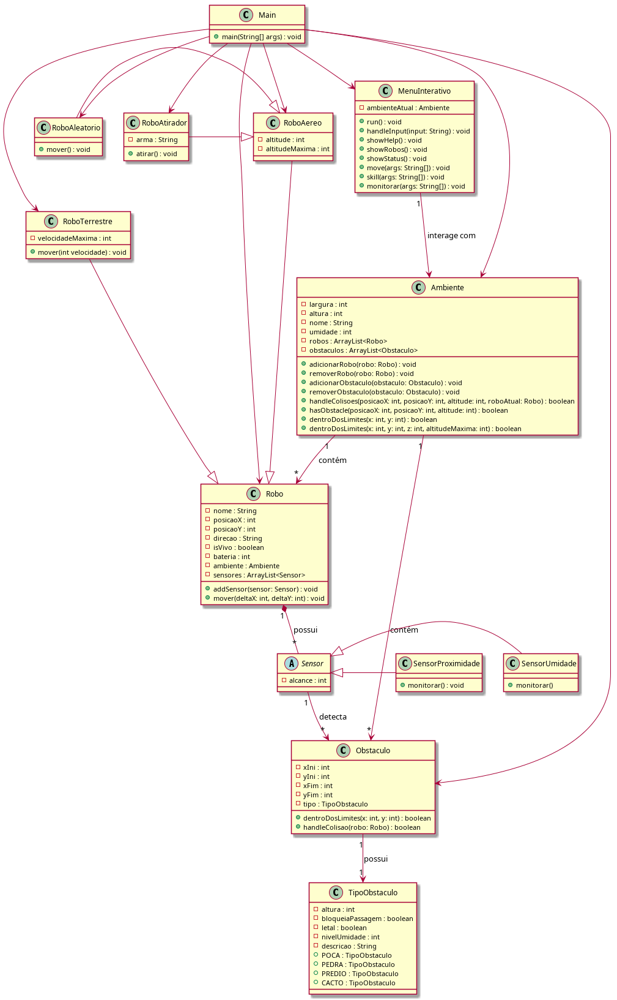

## Simulador de Robôs — Laboratórios MC322 (UNICAMP, 2025/1)

**Autores:** Giovanni Santos Scalabrin (RA 281210) & Rodrigo Banin Ferraz Camargo (RA 238257)

---

### Descrição
Este repositório reúne os laboratórios da disciplina MC322 (Programação Orientada a Objetos) do Instituto de Computação da UNICAMP, oferecida no período 2025/1. Cada exercício acrescenta funcionalidades ao simulador de robôs, explorando herança, composição e padrões de projeto.

### Ferramentas
- **IDE:** Visual Studio Code
- **Java:** OpenJDK 21.0.5

---

### Estrutura do Projeto
```
├── bin/               # Classes compiladas
├── src/               # Código-fonte dos laboratórios
│   ├── lab01/         # Laboratório 1
│   ├── lab02/         # Laboratório 2
│   └── lab03/         # Laboratório 3
│       ├── Main.java
│       └── lab03.png  # Diagrama de classes
└── README.md          # Este arquivo
```

---

### Compilação e Execução
1. **Compilar o laboratório desejado**
   ```bash
   javac -d bin $(find src/lab03/ -name "*.java")
   ```
2. **Executar a aplicação**
   ```bash
   java -cp bin Main
   ```
> Substitua `lab03` pelo diretório correspondente ao laboratório que deseja compilar.

---

### Visão Geral da Arquitetura
Cada laboratório incrementa o simulador com novas classes de robôs e componentes ambientais.
- **Herança:** classes derivadas de `Robo` (e.g., `RoboAtirador`, `RoboTerrestre`, `RoboAereo`, `RoboAleatorio`).
- **Composição:** elementos do ambiente, como obstáculos e sensores.
- **Diagrama de Classes:** mostra relacionamentos, atributos e métodos com suas respectivas visibilidades.

<p align="center">
  
</p>

---

### Comandos de Simulação
| Comando                         | Descrição                                                                                           |
|---------------------------------|-----------------------------------------------------------------------------------------------------|
| `end`                           | Encerra a simulação                                                                                 |
| `showRobos`                     | Lista todos os robôs presentes no ambiente                                                           |
| `status <nome_robo>`            | Exibe posição, tipo e nível de bateria do robô                                                      |
| `move <nome_robo> <dx> <dy>`    | Move o robô pelas coordenadas (Δx, Δy), respeitando obstáculos e limites do mapa                    |
| `special <nome_robo> <ação> ...`| Executa uma habilidade específica do robô                                                           |
| `monitorar <nome_robo> <sensor>`| Usa um sensor para monitorar o ambiente                                                              |

**Ações Especiais por Classe**
- **RoboAtirador:** `atirar`
- **RoboTerrestre:** `turbo <dx> <dy> <velocidade>`
- **RoboAereo:** `subir <dz>` \| `descer <dz>`
- **RoboAleatorio:** `aleatorio`

**Tipos de Sensores**
- `proximidade`: detecta objetos próximos
- `umidade`: mede o nível de umidade no ambiente

---
